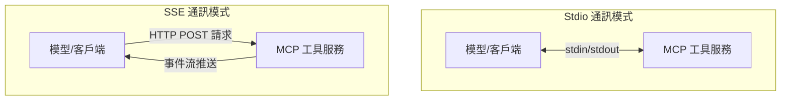
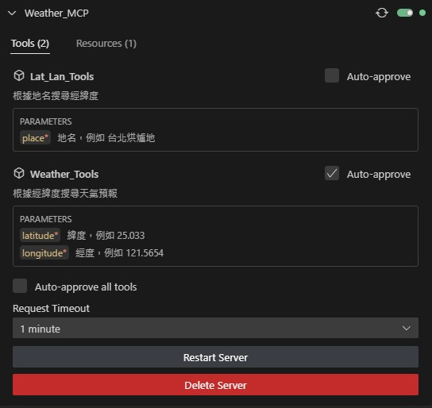
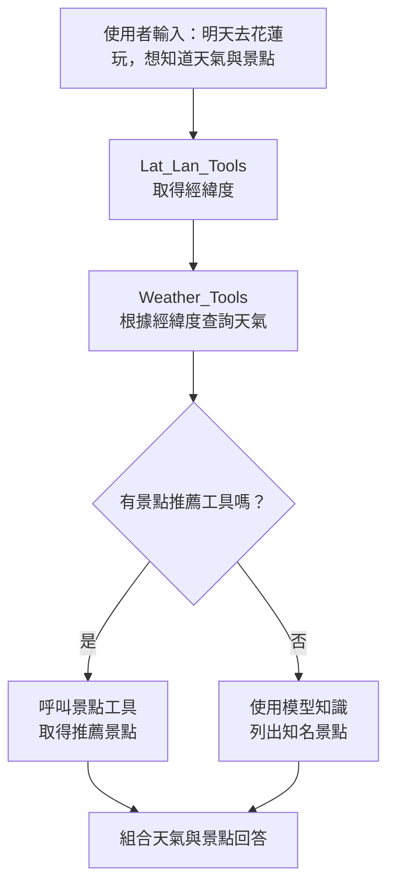

# MCP (Model Context Protocol) 介紹

MCP 是 Anthropic 在 2024 年 11 月推出的標準化工具呼叫協定，讓大型語言模型能夠：

1. 動態探索外部工具（如天氣 API、資料庫、GitHub 等）
2. 使用結構化參數自動呼叫工具
3. 執行複合式任務流程（如天氣查詢任務）

## 目錄
1. [什麼是 MCP](#什麼是-mcp)
2. [MCP 核心問題解析](#mcp-核心問題解析)
3. [MCP 運作原理](#mcp-運作原理)
4. [MCP 配置方法](#MCP-配置方法)
5. [MCP Server中工具使用流程設計](#MCP-Server中工具使用流程設計) 
6. [模型支持?](#模型支持)


## 什麼是 MCP
MCP (Model Context Protocol) 是由開發 Claude 模型的美國新創公司 Anthropic 推出的標準化工具箱，它為大型語言模型提供了與外部工具和 API 交互的統一框架。

**簡而言之：MCP 是大模型的標準化工具箱。**


## MCP 核心問題解析

### 1. 大模型如何發現工具箱中的工具？
MCP 提供標準化工具發現機制，每個 MCP 伺服器需公布：
- 🔧 工具名稱  
- 📝 功能描述  
- 🛠️ 參數格式  
- 🧪 使用示例

### 2. 工具調用參數規範
MCP 工具參數使用 JSON Schema 規範定義：
```json
{
  "$schema": "http://json-schema.org/draft-07/schema#",
  "type": "object",
  "properties": {
    "param1": {"type": "string"},
    "param2": {"type": "number"}
  }
}
```

### 3. MCP 與 Function Call 關係

Function Call 是大型語言模型調用外部功能的一種機制，而 MCP 可以被視為 Function Call 的標準化和擴展版本。

| 特性 | Function Call | MCP 優勢 |
|------|--------------|----------|
| 標準化程度 | 各平台實現不同 | 統一跨平台調用接口 |
| 工具發現 | 靜態定義 | 動態工具發現機制 |
| 功能範圍 | 基本工具調用 | 複合工具流程支持 |
| 兼容性 | 特定模型專用 | 多層適配架構 |
| 參數驗證 | 有限 | 完整 JSON Schema 支持 |
| 上下文處理 | 單次調用 | 支持多輪上下文 |

MCP 在設計上是 Function Call 的進一步發展和標準化，它提供了更完整的框架來處理模型與外部工具的交互，特別是在處理複雜的多步驟工作流程時更加強大。

### 4. 模型兼容性
- ✅ 原生支持 function call 模型
- 🔄 需適配層轉換模型
- 🌐 通用協議設計


## MCP 運作原理

MCP 採用三階段循環架構：

1. **上下文初始化**  
   - 模型載入基礎環境設定
   - 建立通訊管道

2. **動態數據交換**  
   ```mermaid
   graph LR
   A[模型] -->|請求| B(MCP伺服器)
   B -->|響應| A
   ```

3. **持續優化階段**
   - 模型根據任務需求動態選擇工具
   - 根據工具回傳結果調整後續行動


## MCP 配置方法

### MCP 傳輸模式比較：Stdio vs SSE

Model Context Protocol (MCP) 支援多種傳輸模式，其中最常用的是 Stdio 和 SSE。本文檔簡要對比這兩種傳輸方式的差異與通訊特點。

| 特性 | Stdio | SSE |
|-----|-------|-----|
| 全名 | Standard Input/Output | Server-Sent Events |
| 通訊模型 | 進程間通訊 | HTTP 長連接推送 |
| 適用場景 | 本地開發與測試 | 分布式系統與網絡服務 |

### 通訊模式對比



### 不同傳輸模式配置方法

#### Stdio (Standard Input/Output)

```python
# 服務器配置 > transport="stdio"
if __name__ == "__main__":
    print("Starting MCP server...")
    mcp.run(transport="stdio")
```

```json
//客戶端配置示例
{
  "Weather_MCP": {
    "command": "python",
    "args": [
      "./server.py",
      "run",
      "server.py"
    ],
    "disabled": false,
    "autoApprove": []
  }
}
```

- **通訊方式**：透過標準輸入/輸出流進行資料交換
- **連接方式**：直接進程啟動，沒有網絡開銷
- **資料流向**：雙向、同步的資料流
- **優勢**：設置簡單，適合快速開發和測試
- **限制**：僅限於本地機器上的工具調用

#### SSE (Server-Sent Events)

```python
# 服務器配置 > transport="sse"
if __name__ == "__main__":
    print("Starting MCP server...")
    mcp.run(transport="sse")
```
```json
// 客戶端配置示例
{
  "Weather_MCP": {
    "url": "http://localhost:8000/sse"
  }
}
```

- **通訊方式**：基於 HTTP 協議的單向伺服器推送
- **連接方式**：HTTP 長連接
- **資料流向**：主要是服務器到客戶端的推送
- **優勢**：支持分布式部署，跨網絡調用
- **限制**：需要網絡連接和合適的防火牆設置


## MCP Server中工具使用流程設計

### 配置到VScode Cline客戶端



### 以查詢「我明天要去花蓮玩 有哪些推薦的景點 天氣怎樣?」為例：


### 步驟一：查詢經緯度 調用'Lat_Lan_Tools'
向大語言模型詢問「我明天要去花蓮玩 有哪些推薦的景點 天氣怎樣?」
```
get_lat_lan("花蓮")
```

模型會根據工具描述自行填入參數:
Arguments：
```
{
  "place": "花蓮"
}
```

Response：
```json
{
  "latitude": 23.991,
  "longitude": 121.6015
}
```

### 步驟二：查詢天氣預報 調用'Weather_Tools'
使用 Weather_Tools 傳入上一步經緯度，取得天氣資訊。
```
get_weather(latitude=23.991, longitude=121.6015)
```

模型會根據工具描述自行填入參數:
Arguments：
```
{
  "lat": 23.991,
  "lon": 121.6015
}
```

Response：
```
{"coord": {"lon": 121.601, "lat": 23.9926}, "weather": [{"id": 804, "main": "Clouds", "description": "\u9670\uff0c\u591a\u96f2", "icon": "04n"}], "base": "stations", "main": {"temp": 20.73, "feels_like": 21.13, "temp_min": 20.73, "temp_max": 20.73, "pressure": 1018, "humidity": 87, "sea_level": 1018, "grnd_level": 954}, "visibility": 10000, "wind": {"speed": 2.11, "deg": 309, "gust": 1.4}, "clouds": {"all": 100}, "dt": 1744725312, "sys": {"type": 2, "id": 2096350, "country": "TW", "sunrise": 1744666338, "sunset": 1744712078}, "timezone": 28800, "id": 1668885, "name": "Shuiyuandi", "cod": 200}
```

### 步驟三：補充景點推薦 沒有相關工具
未找到景點相關工具時，模型根據現有知識提供資訊

### 最後總結輸出結果
```
花蓮明日天氣預報：
- **天氣狀況：多雲
- **溫度：20.73°C
- **體感溫度：21.13°C
- **濕度：87%
- **風速：2.11 m/s

推薦景點：
1. 太魯閣國家公園 - 以壯麗峽谷和步道聞名
2. 七星潭 - 新月形海灣適合觀賞日出和星砂
3. 鯉魚潭 - 環湖自行車道與水上活動
4. 東大門夜市 - 在地美食聚集地（推薦炸彈蔥油餅）
5. 雲山水夢幻湖 - 落羽松秘境與生態園區
```

這種多步驟工具呼叫設計展示了 MCP 在複雜任務中的應用能力。

## 模型支持?

### MCP 與 AI 模型的對接機制
在 MCP（Model Context Protocol）架構中，雖然工具調用（Tool Calling）是核心能力，但不代表所有操作都由模型本身完成。實際的對接行為，是由 模型 + 客戶端 共同完成的協作過程。

### ❓ 模型是否一定要支援 Function Call 才能使用 MCP？

答案是：Function Call 是對接 MCP 所需的功能，但不一定由模型本身直接執行。 也就是說，需要有能力觸發工具調用，但這個觸發指令不一定得是模型原生的 'tool_call' 格式。

## 對比兩種典型的對接架構

### ✅ 模型原生支援 Function Call（如 GPT-4-turbo + 5ire）
- **模型環境**：GPT-4-turbo
- **客戶端平台**：5ire (用於支援 GPT 模型與外部工具，如 MCP，的對接)
- **模型 Function Call 支援**：✅ 支援
- **誰負責執行 Function Call**：5ire（依模型產生的 tool_call 指令自動執行）
- **能否對接 MCP**：✅ 是
- **流程說明**：
  1. 客戶端 (5ire) 將用戶請求及可用工具的描述 (function schema) 發送給模型。
  2. 模型本身能根據工具描述自動產生結構化的 tool_call。
  3. 客戶端 (5ire) 負責接收、解析這個 tool_call，然後執行對應的工具（與 MCP 互動或直接調用 API）。
  4. 客戶端將執行結果回傳給模型。
  5. 模型根據結果生成最終回覆。

此模式下，模型與 MCP/工具間的互動是高度自動化的，對使用者來說過程相對透明。

### ✅ 模型不支援 Function Call（如 DeepSeek R1 + Cline for VSCode）
- **模型環境**：DeepSeek R1 (假設不原生支援 Function Call)
- **客戶端平台**：Cline (VSCode 的一個擴充插件，用作智能客戶端)
- **模型 Function Call 支援**：❌ 不支援
- **誰負責執行 Function Call**：Cline（根據模型輸出的文字判斷意圖，轉換並執行）
- **能否對接 MCP**：✅ 是
- **流程說明**：
  1. 客戶端 (Cline) 在發送用戶請求給模型之前，會先在 Prompt 中注入可用工具的描述。這通常是以自然語言或特定格式告知模型：「你可以使用 get_weather(latitude, longitude) 來查詢天氣」。
  2. 模型接收到包含用戶請求和工具描述的 Prompt。
  3. 模型理解請求後，決定需要使用工具，但它無法生成結構化的 tool_call，因此它會產出指示性的文字，例如："好的，我來查一下天氣：get_weather(latitude=24.16, longitude=120.64)"。
  4. 客戶端 (Cline) 解析模型回傳的這段文字，識別出 get_weather(...) 的意圖和參數。
  5. 客戶端 (Cline) 將解析出的意圖和參數，轉換為實際的工具調用請求（可能是符合 MCP 格式的 tool_call，或直接呼叫 API）。
  6. 客戶端 (Cline) 負責執行這個工具調用，並獲取結果。
  7. (可選) 客戶端將工具執行結果再發回給模型，讓模型整合資訊後生成最終回覆。
  8. 客戶端顯示結果（可能是工具直接結果或模型整理後的回覆）。

## 總結比較

| 模型環境 | 客戶端平台 | 是否支援 Function Call（模型） | 誰負責轉換/執行 Function Call | 是否能對接 MCP |
|---------|------------|----------------------------|--------------------------|--------------|
| GPT-4-turbo | 5ire | ✅ 支援 | 5ire（依模型 tool_call 自動執行） | ✅ 是 |
| DeepSeek R1 | Cline (VSCode) | ❌ 不支援 | Cline（解析模型文字，轉換並執行） | ✅ 是 |
